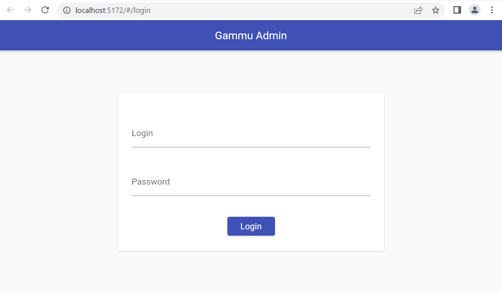
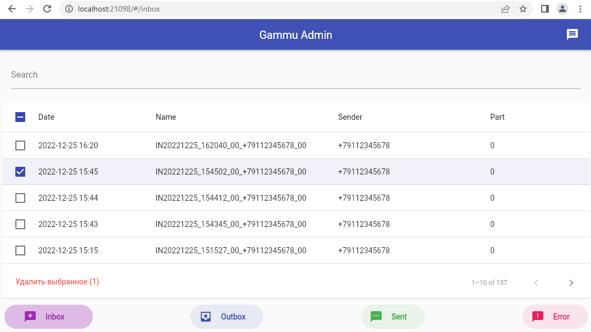
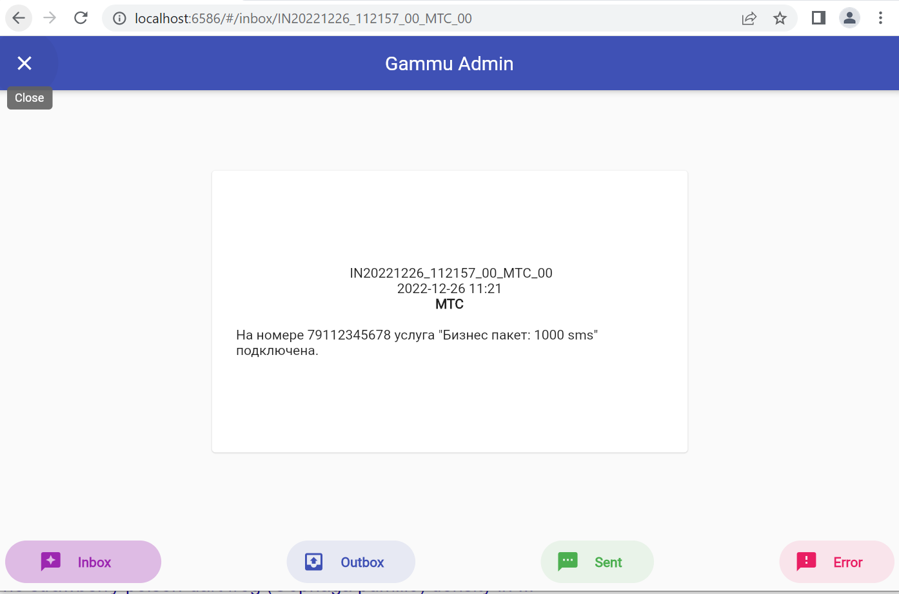
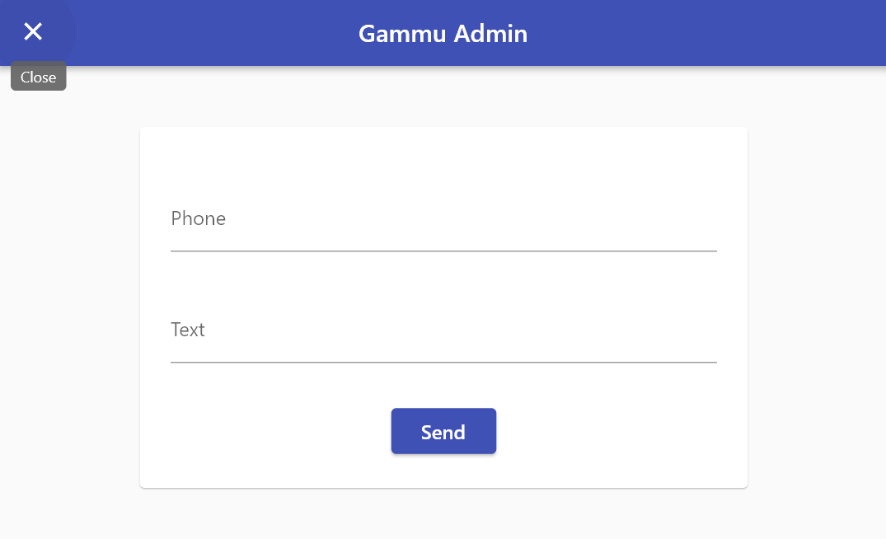

### Simple Gammu Admin
Frontend - Flutter\
Backend - Dart (dart_frog)

Env file\
login=admin\
password=password\
backend=http://127.0.0.1:9000\
backendPort=9000\
frontendPort=8000\
gammuPath=/var/spool/gammu

